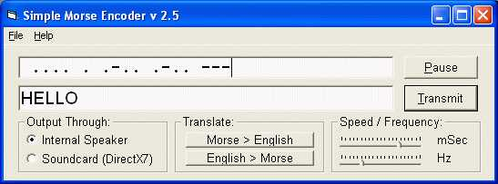



## Simple Morse Encoder v 2\.5

### Description

Simple Morse Encoder version 2.5

**Major Update over 2.0**

Translates from English to Morse Code and also generates sound from the PC Speaker/Soundcard

What's New in V 2.5

1. A totally new and (possibly) better interface  

2. Algorithms fully rewritten for improved

efficiency and accurate timing.  

3. Two way translation capable.  

4. Corrected the "Inverse Speed" itch!  

5. Pause function added.  
 
### More Info
 

             |
---                |---
**Submitted On**   |2002-12-22 16:54:44
**By**             |[Harshad Sharma \(aka Datamatrix\)](https://github.com/Planet-Source-Code/PSCIndex/blob/master/ByAuthor/harshad-sharma-aka-datamatrix.md)
**Level**          |Intermediate
**User Rating**    |4.4 (22 globes from 5 users)
**Compatibility**  |VB 6\.0
**Category**       |[Sound/MP3](https://github.com/Planet-Source-Code/PSCIndex/blob/master/ByCategory/sound-mp3__1-45.md)
**World**          |[Visual Basic](https://github.com/Planet-Source-Code/PSCIndex/blob/master/ByWorld/visual-basic.md)
**Archive File**   |[Simple\_Mor1544762152003\.zip](https://github.com/Planet-Source-Code/harshad-sharma-aka-datamatrix-simple-morse-encoder-v-2-5__1-43227/archive/master.zip)

